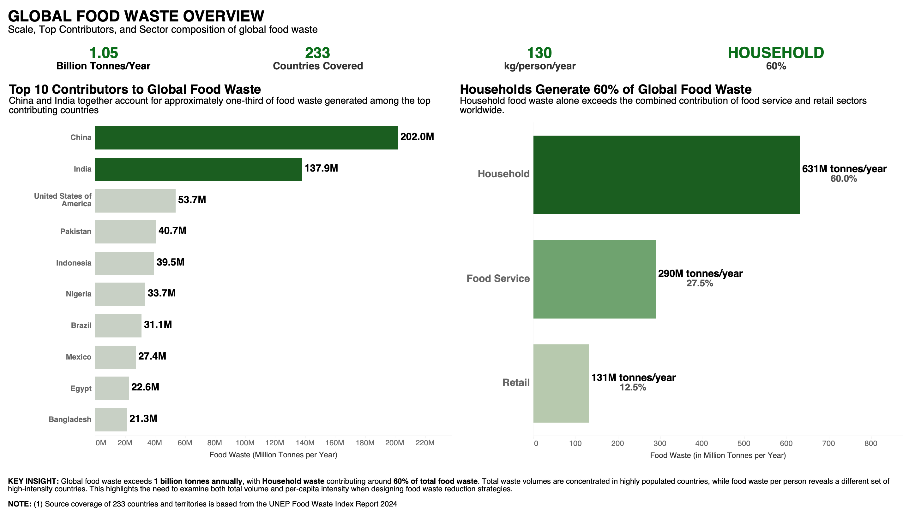
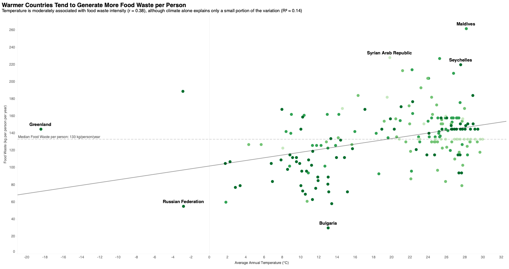
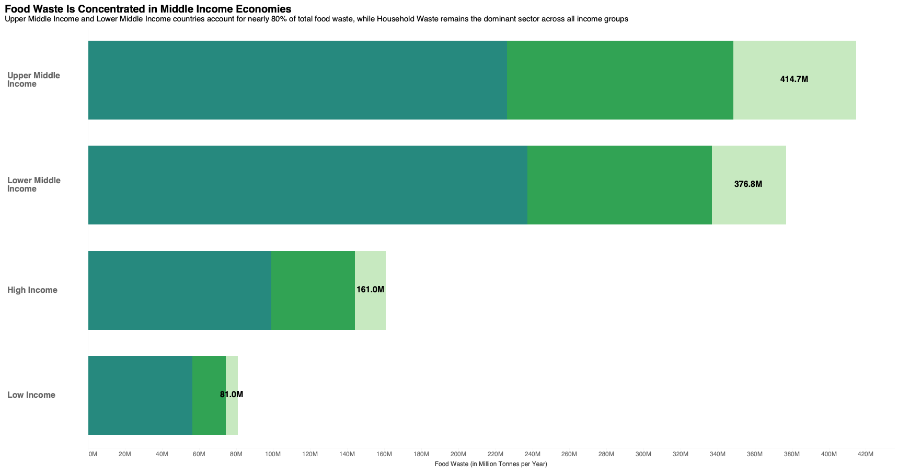
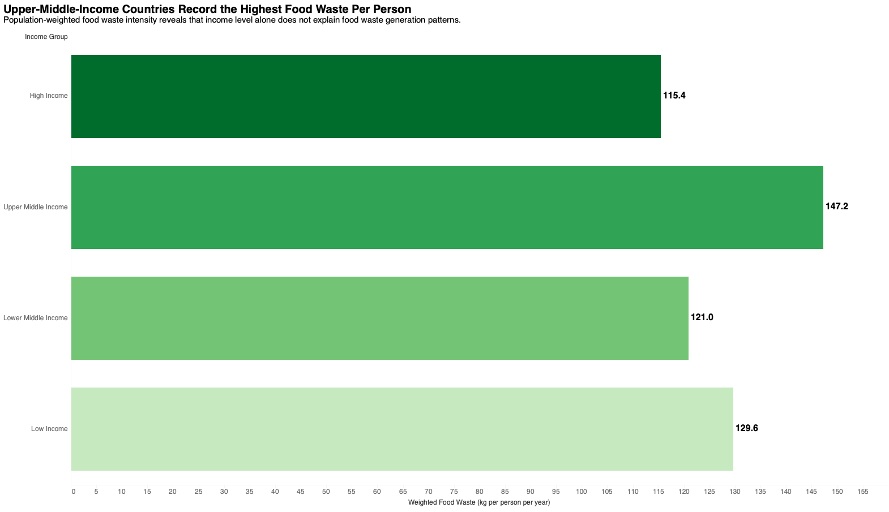
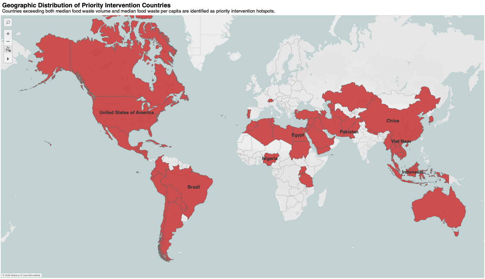
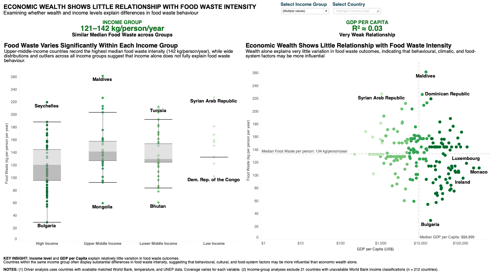
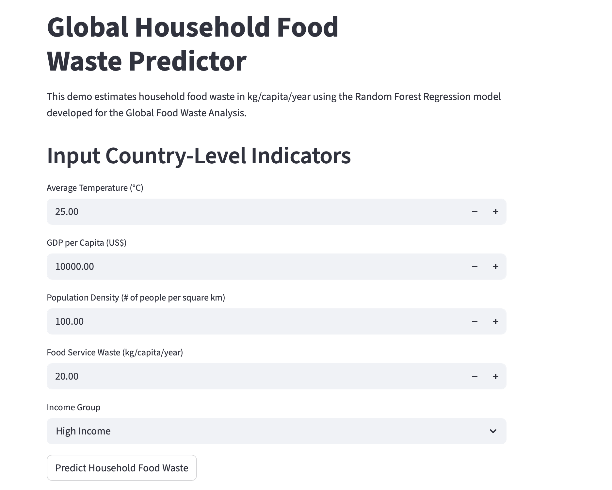

### 🌍 Global Food Waste & Sustainability Analysis
**<font color="green">Identifying Key Drivers of Food Waste & Priority Intervention Countries Through Data Analytics** </font>
<details open>
<summary><b>👓 PROJECT AT A GLANCE</b></summary></br>

| Item | Details |
|---------|------|
| Duration | 4 weeks |
| Role | End-to-End Data Analyst |
| Data | 11 Datasets • 233 Countries • 40+ Features |
| ML Models | 3 Data Models |
| Tools | Python • Pandas • Scikit-learn • Tableau • Streamlit • Git • GitHub |
| Deliverables | • [Python Notebook](/notebooks/global-food-waste-sustainability-notebook.ipynb) </br> • [Tableau Interactive Dashboards](https://us-east-1.online.tableau.com/#/site/gaenterpriselicenses/collections/999465e4-5105-4936-987f-7c60e14b640e?:origin=card_share_link) </br>• Predictive Model </br>• Streamlit App </br> • [Technical Report](reports/Global_Food_Waste_Sustainability_Technical_Report.pdf) </br> • [Presentation Slides](reports/Global_Food_Waste_Sustainability_Presentation.pdf) |

</details>

---

<details open>
<summary><b>📌 PROJECT OVERVIEW</b></summary></br>

**The Challenge**

Over **1 billion tonnes** of food are wasted annually worldwide, yet the underlying drivers remain poorly understood.

This project investigates whether climate, population, and economic indicators can explain food waste patterns and support evidence-based sustainability decisions.


</details>

---

<details open>
<summary><b>🎯 BUSINESS PROBLEM</b></summary></br>

Food Waste is a growing global sustainability challenge that impacts **Food Security, Climate Change, Economic Productivity and Resource Sustainability**.

Governments, sustainability organisations, NGOs, and policymakers require reliable evidence to determine where interventions will have the greatest impact.

This project answers **key business questions**:

- Which countries generate the most food waste?
- Does economic wealth influence food waste?
- Is food waste primarily driven by population or climate?
- Which countries should be prioritised for intervention?
- Can household food waste be predicted using publicly available country indicators?

</details>

---

<details open>
<summary><b>🗂 DATASETS</b></summary></br>

| Source | Description | Link |
|---------|-------------|-----|
| United Nations Environment Program (UNEP) Food Waste Index Report 2024 | - Household Food Waste Estimates</br> - Food Service Waste Estimates </br>  - Retail Food Waste Estimates | [View Source](https://www.unep.org/resources/publication/food-waste-index-report-2024) |
| World Bank Open Data | - GDP per Capita</br> - Income Group</br> - Total Population</br> - Population Density</br> - Tourism Arrivals</br> - Electricity Access</br> - CO2 Emissions</br> | [View Source](https://data.worldbank.org) |
| Trading Economics | Average Annual Temperature by Country | [View Source](https://tradingeconomics.com/country-list/temperature) |

</details>

---

<details open>
<summary><b>🔄 ANALYTICS WORKFLOW</b></summary></br>

🧠 Business Understanding</br>
📥 Data Collection</br>
🧹 Data Cleaning & Validation</br>
💻 Feature Engineering</br>
🔍 Exploratory Data Analysis</br>
📊 Data Visualization & Dashboard Development</br>
🔢 Statistical Analysis</br>
🤖 Predictive Modelling</br>
💡 Business Recommendations</br>

</details>

---

<details open>
<summary><b>🛠 TECHNOLOGY STACK</b></summary></br>

| Category | Tools |
|----------|------|
| Programming |  |
| Data Cleaning |  |
| Statistical Analysis |  |
| Data Visualisation |  |
| Machine Learning |  |
| Development |  |
| App Deployment |  |
| Version Control |   |
| Presentation |   |


</details>

---

<details open>
<summary><b>📈 KEY INSIGHTS</b></summary></br>

**🏠 Households generate 60% of total food waste.**

 **🗺️ Population is the strongest driver of total food waste.**

Countries with larger populations generate substantially higher food waste volumes than smaller nations.



---

 **🌡️ Temperature shows a stronger relationship with food waste than GDP.**

Warmer countries generally experience higher household food waste per capita than economic wealth.



---

 **💰 Higher-income countries are not automatically the biggest food wasters.**

Food waste occurs across all income groups, suggesting that behavioural and environmental factors matter more than economic wealth alone.




**🌎 60 countries present the greatest opportunity for intervention.**



</details>

---

<details open>
<summary><b>📊 INTERACTIVE DASHBOARD</b></summary></br>

The Tableau dashboard enables users to:

- Explore food waste by country
- Compare income groups
- Analyse relationships between climate, GDP and population
- Identify high-risk countries
- Interactively filter countries and income categories

🔗 **[View Interactive Tableau Dashboard](https://us-east-1.online.tableau.com/#/site/gaenterpriselicenses/collections/999465e4-5105-4936-987f-7c60e14b640e?:origin=card_share_link)**


**Dashboard Highlights**

- Global Food Waste Overview
- Food Waste Drivers
- Income and Economic Factors
- Food Waste Risk & Opportunity Profile



</details>

---

<details open>
<summary><b>🤖 PREDICTIVE MODELING</b></summary></br>

**Objective:** To predict household food waste (kg per capita per year).

**Models Evaluated**

| Model | Result |
|-------|--------| 
| Baseline | Reference |
| Linear Regression | Improved |
| 🌳 Random Forest Regression | ✅ Best Performance |

**Features Used**

- Average Temperature
- GDP per Capita (log)
- Population Density (log)
- Income Group
- Food Service Waste per Capita 

**Evaluation Metrics Included**

- Mean Absolute Error (MAE)
- Root Mean Squared Error (RMSE)
- R-Squared of Coeffiecient of Determination (R²)

The Random Forest model demonstrated the strongest predictive performance and captured the complex non-linear relationships between environmental and socio-economic variables.

</details>

---

<details open>
<summary><b>🗂️ REPOSITORY STRUCTURE</b></summary></br>


| Folder        | Description                |
| ------------- | -------------------------- |
| 📁 app        | Streamlit Application      |
| 📁 charts     | Exploratory Visualisations |
| 📁 dashboards | Tableau Dashboards         |
| 📁 data       | Raw and Cleaned Datasets, <br> Audit Country Matching &  Data Model |
| 📁 notebooks  | End-to-end Python analysis |
| 📁 reports    | Technical Report & Presentation Slides           |

</details>

---

<details open>
<summary><b>🚀 INTERACTIVE STREAMLIT DEMO</b></summary></br>




</details>

---

<details open>
<summary><b>🏃🏻‍♀️ HOW TO RUN THE STREAMLIT DEMO</b></summary></br>

This project includes a Streamlit demo app that predicts household food waste using the Random Forest model.

**1. Clone the repository**

```bash
git clone https://github.com/thedataanalyst-ylime/data-analytics-portfolio/tree/main/featured-projects/global-food-waste-sustainability
```

**2. Navigate to the project folder**

```bash
cd data-analytics-portfolio/featured-projects/global-food-waste-sustainability
```

**3. Create a virtual environment**

For Mac:
```bash
python -m venv venv
```

For Windows:
```bash
venv\Scripts\activate
```

**4. Activate the virtual environment**

```bash
source venv/bin/activate
```

**5. Install the required libraries**

```bash
pip install -r app/requirements.txt
```

**6. Run the Streamlit app**

```bash
streamlit run app/predict_household_foodwaste_demo.py
```

**7. Open the app in your browser**

After running the command, Streamlit will show a local URL such as:
```bash
http://localhost:8501
```
Open this link in your browser to use the demo.

</details>

---

<details open>
<summary><b>💡 BUSINESS RECOMMENDATIONS</b></summary></br>

| Audience | Actionable Measures |
|----------|------|
| United Nations Environment Programme (UNEP) | 1. Strengthen global food waste measurement and reporting standards </br> 2. Prioritize support for high-risk intervention countries  |
| Policymakers and Government Agencies  | 1. Establish national food waste reduction targets </br> 2. Promote household food waste awareness and education  |
| Sustainability Practitioners  | 1. Improve food waste monitoring and measurement practices </br> 2. Focus resources on high-impact sectors and countries |
| Researchers  | 1. Investigate behavioural, cultural, and food-system drivers of food waste </br> 2. Develop more advanced predictive and forecasting models |
| Non-Governmental Organizations (NGOs)  | 1. Deliver community-based food waste education programs </br> 2. Expand food rescue and redistribution initiatives |
| Students and Data Analysts  | 1. Use data to understand and solve sustainability challenges </br> 2. Communicate findings through impactful data storytelling |

</details>

---

<details open>
<summary><b>✨ FUTURE ENHANCEMENTS</b></summary></br>

**1. Additional Datasets** 
    Incorporate additional variables such as food prices, urbanization rates, food insecurity indicators, waste management infrastructure, consumer behavior metrics, and government sustainability policies

**2. Time-series Analysis** 
    Expanding the analysis to include multiple years of food waste data would enable the study of trends, seasonality, and changes in food waste patterns over time.

**3. Advanced Predictive Modeling**
    Evaluate more advanced machine learning techniques, such as Gradient Boosting, XGBoost, Random Forest optimization, or ensemble models, to improve predictive performance and uncover more complex relationships between variables.

**4. Geographic and Regional Analysis**
    Additional analysis at regional, sub-national, or city levels could help identify localized food waste patterns and support more targeted interventions. This would be particularly valuable for countries with significant population and socioeconomic diversity.

**5. Enhanced Dashboard Capabilities**
    Include trend analysis, scenario modeling, country benchmarking, predictive forecasting, and progress tracking against food waste reduction targets to provide stakeholders with more actionable insights for monitoring and decision-making.

</details>

---

⭐ **Thank you for exploring this project.**
If you're interested in data analytics, sustainability, or machine learning, I'd love to connect and discuss how data can drive meaningful business and social impact.</br>

📧 [Email](mariaemilysy@gmail.com)</br>
💼 [LinkedIn](https://www.linkedin.com/in/emilysy/)</br>
💻 [Data Analytics Portfolio](https://github.com/thedataanalyst-ylime/data-analytics-portfolio)</br>

---