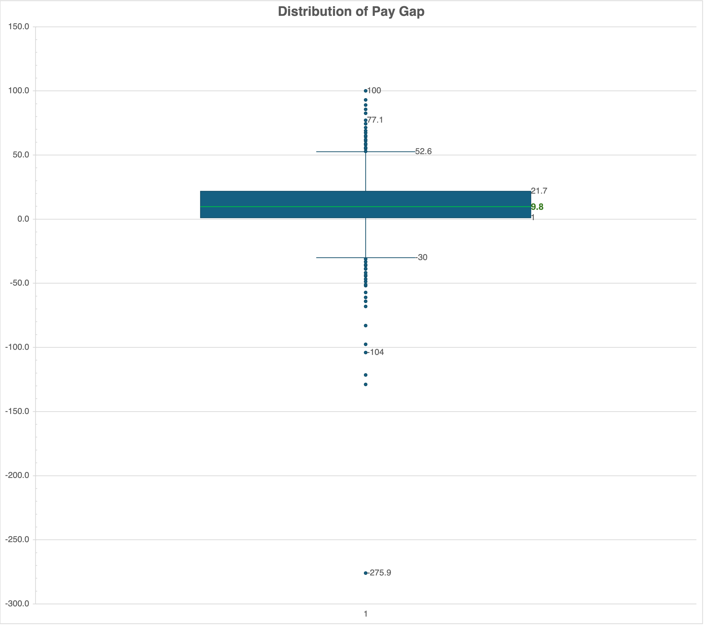
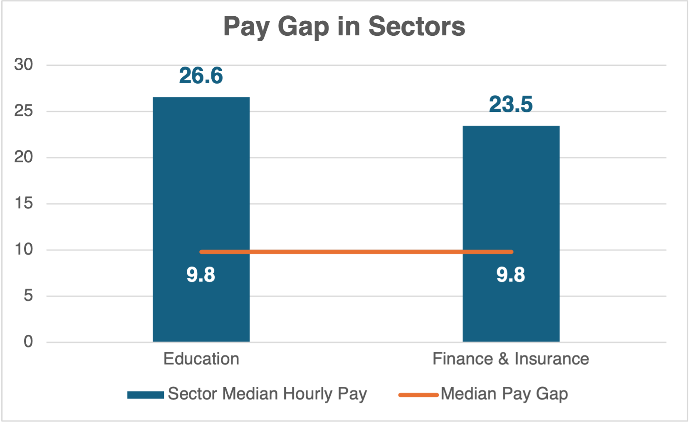
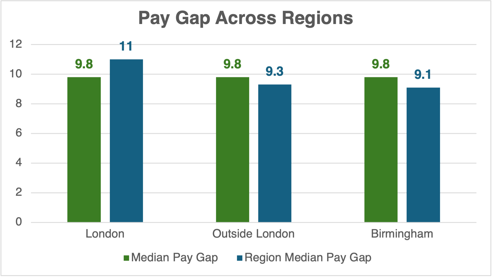
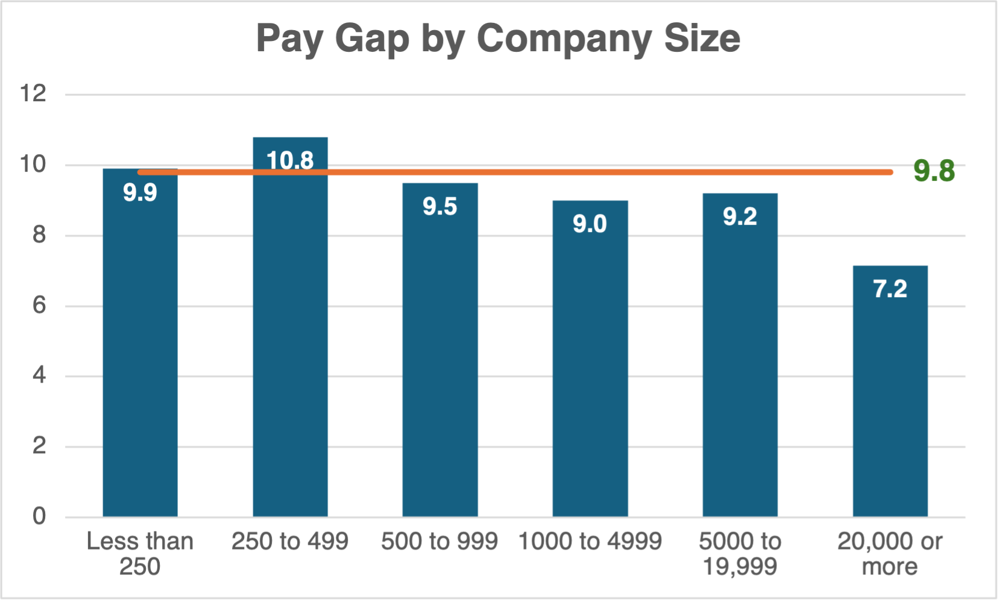

### 🇬🇧👩👱🏻‍♂️ UK Gender Pay Gap Analysis
**SQL | Data Storytelling | Business Intelligence | Workforce Analytics** 

A business intelligence project analysing gender pay disparities across more than 10,000 UK employers to uncover workforce representation patterns and identify opportunities for greater pay equity.

<b>👓 EXECUTIVE SUMMARY</b>
 

🇬🇧 Analysed the UK Government Gender Pay Gap dataset covering over **10,000 employers** across multiple industries 
📈 End-to-end **SQL analytics workflow** from data exploration and analysis 
💡 Proposed recommendations for the UK government for improvements in both data collection and organisational practices to better understand and address the gender pay gap  

---

<b>📌 PROJECT OVERVIEW</b>
 

| Category | Details |
|------|--------|
| **Analytics Capabilities** | 🧠 Business Analysis   🔍 Exploratory SQL Analysis   📈 Business Insights   📊 Data Storytelling   💡 Recommendations |
| **Technology Stack** |  •  •   |
| **Project Artefacts** | 🔍 [SQL Analysis](sql/UK_Gender_Pay_Gap_Analysis_SQL.pdf)   📄 [Technical Report](report/UK_Gender_Pay_Gap_Analysis_Report.pdf)   🎤 [Presentation Slides](presentation/UK_Gender_Pay_Gap_Analysis_Presentation.pdf)  |

---

<b>🎯 BUSINESS PROBLEM AND IMPACT</b>
 

**Business Problem** 

Many organisations monitor gender pay gaps, but identifying where inequality exists and what organisational characteristics contribute to it remains challenging. 

Using publicly available UK reporting data, this project investigates: 
- Which industries experience the largest gender pay gaps? 
- Does organisation size influence pay inequality? 
- How does workforce representation affect pay gaps? 
- What patterns exist across bonus payments? 
- Which organisations appear to be outliers? 

---

**Business Impact** 

Understanding gender pay inequality enables organisations to: 
- Improve workforce planning 
- Strengthen diversity initiatives 
- Support ESG reporting 
- Improve transparency 
- Identify structural pay disparities 

---

<b>📈 KEY INSIGHTS</b>
 

**On average, women earn approximately 10% less than men across organisations.**

The distribution of the gender pay gap across companies is wide and skewed with most companies clustered around the median of approximately 10% but with a number of companies with extreme high pay gaps.

**The gender pay gap is primarily driven by differences in representation across roles and levels**, rather than unequal pay for the same work. Men are more likely to be represented in higher-paying roles. 

The Education sector is a female-dominated and Finance & Insurance is a high-paying sector both show notably higher pay gaps. 

**Gender pay gap is a widespread issue across all regions.** 
Pay differences are slightly more pronounced among London-based
organisations where the concentration of high-paying industries and roles,
and where men are more likely to be represented in senior positions. 

**There is no strong relationship between company size and the gender pay gap,**
Suggesting that organisational scale alone does not explain the differences. 

**Gender Pay Gap ≠ Unlawful Pay Discrimination**
Instead, it reflects broader structural factors such as the distribution of men and women across different roles and levels within organisations. 

---

<b>💡 BUSINESS RECOMMENDATIONS</b>
 

- Enhance data granularity to better understand drivers such as job roles and levels, career progression and promotions, and tenure and experience. 

- Improve consistency and clarity in reporting. 

- Capture more precise workforce measures such as actual employee counts. 

- Encourage organisations to address progression pathways. 

---

<b>⚠️ DATA LIMITATIONS & KEY CAVEATS </b>
 

- Analysis is based on employer-level reporting rather than workforce-weighted
measures 

- Only includes full-pay relevant employees, excluding those on leave such as
such as maternity, paternity, sick, sabbatical, or other forms of leave 

- Does not include role-level or job-specific information 

- Data represents a single reporting period and does not allow for trend analysis
over time 

- Self-reported by employers 

- Region analysis is based on employer postal code 

- Inconsistent or multiple industry classifications (SIC codes) 

- Structural limitations in the dataset 

- Only companies with 250 or more employees are legally required to submit data, meaning the entire small-employer population is absent from this dataset

---

<b>🗂 DATASET</b>
 

 Source | Description | Link |
|---------|-------------|-----|
| UK Government Gender Pay Gap Reporting Service | Annual employer-reported gender pay statistics | [View Data](data/gender_pay_gap_21_22.csv) |

Dataset includes: 
- Mean hourly pay gap 
- Median hourly pay gap 
- Bonus pay gap 
- Bonus participation 
- Workforce pay quartiles 
- Employer size 
- Industry classification 
- Reporting compliance 

---

<b>🗂️ REPOSITORY STRUCTURE</b>
 

| Folder        | Description              |
| ------------- | ------------------------ |
| 📁 charts     | Visualisations |
| 📁 data       | Gender Pay Gap Dataset |
| 📁 sql  | End-to-end SQL analysis |
| 📁 report    | Technical Report | 
| 📁 presentation    | Presentation Slides |

---

⭐ **Thank you for exploring this project.**
This demonstrates how data analytics can transform datasets into meaningful insights and actionable recommendations.  

If you'd like to discuss data analytics, employee engagement, or opportunities to collaborate, I'd be happy to connect.
 

📧 [Email](mariaemilysy@gmail.com) 
💼 [LinkedIn](https://www.linkedin.com/in/emilysy/) 
💻 [Data Analytics Portfolio](https://github.com/thedataanalyst-ylime/data-analytics-portfolio) 

---